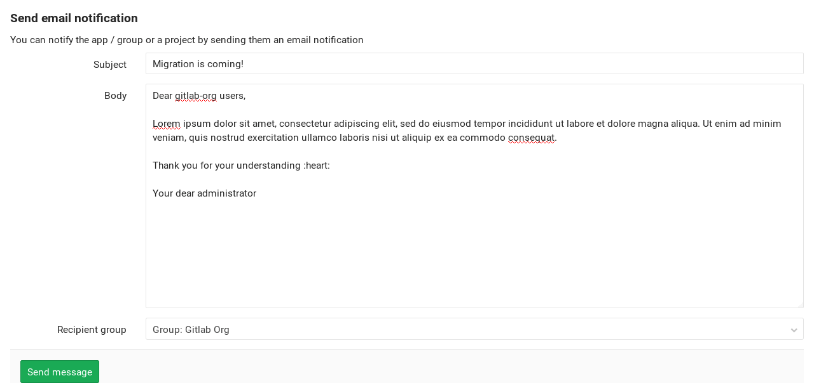

# Email from GitLab **(PREMIUM SELF)**

GitLab provides a tool to administrators for emailing all users, or users of
a chosen group or project, right from the Admin Area. Users receive the email
at their primary email address.

For information about email notifications originating from GitLab, read
[GitLab notification emails](../user/profile/notifications.md).

## Use-cases

- Notify your users about a new project, a new feature, or a new product launch.
- Notify your users about a new deployment, or that downtime is expected
  for a particular reason.

## Sending emails to users from GitLab

1. On the left sidebar, expand the top-most chevron (**{chevron-down}**).
1. Select **Admin Area**.
1. Select **Overview > Users**.
1. Select **Send email to users**.

   

1. Compose an email and choose where to send it (all users or users of a
   chosen group or project). The email body only supports plain text messages.
   HTML, Markdown, and other rich text formats are not supported, and is
   sent as plain text to users.

   

NOTE:
[Starting with GitLab 13.0](https://gitlab.com/gitlab-org/gitlab/-/issues/31509), email notifications can be sent only once every 10 minutes. This helps minimize performance issues.

## Unsubscribing from emails

Users can choose to unsubscribe from receiving emails from GitLab by following
the unsubscribe link in the email. Unsubscribing is unauthenticated in order
to keep this feature simple.

On unsubscribe, users receive an email notification that unsubscribe happened.
The endpoint that provides the unsubscribe option is rate-limited.

<!-- ## Troubleshooting

Include any troubleshooting steps that you can foresee. If you know beforehand what issues
one might have when setting this up, or when something is changed, or on upgrading, it's
important to describe those, too. Think of things that may go wrong and include them here.
This is important to minimize requests for support, and to avoid doc comments with
questions that you know someone might ask.

Each scenario can be a third-level heading, for example `### Getting error message X`.
If you have none to add when creating a doc, leave this section in place
but commented out to help encourage others to add to it in the future. -->
