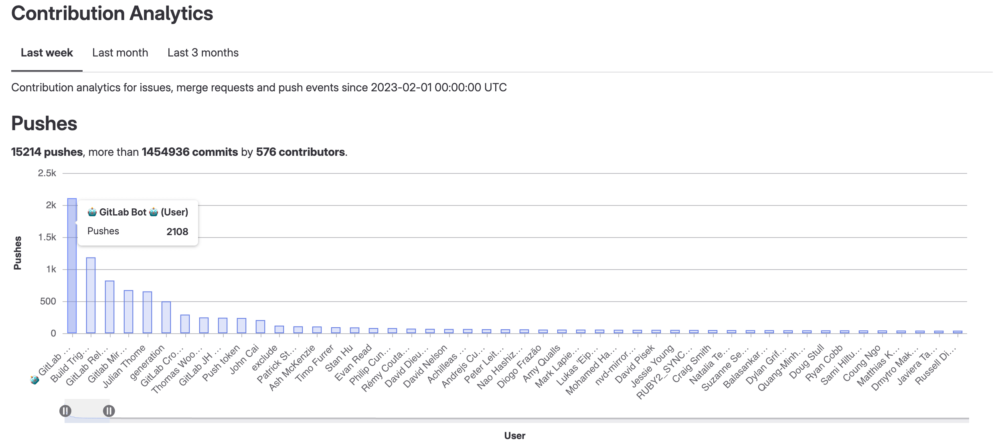

# Contribution analytics **(PREMIUM ALL)**

> [Introduced](https://gitlab.com/gitlab-org/gitlab/-/issues/3090) in GitLab 12.2 for subgroups.

Contribution analytics provide an overview of the
[contribution events](../../profile/contributions_calendar.md#user-contribution-events) made by your group's members.

Use contribution analytics data visualizations to:

- Analyze your group's contributions over a period of time.
- Identify group members who are high-performers or may benefit from additional support.

## View contribution analytics

To view contribution analytics:

1. On the left sidebar, at the top, select **Search GitLab** (**{search}**) to find your group.
1. Select **Analyze > Contribution analytics**.

Three bar charts and a table illustrate the number of contributions made by each group member:

- Push events
- Merge requests
- Closed issues

### View a member's contributions

You can view the number of events associated with a specific group member.

To do this, hover over the bar with the member's name.

### Zoom in on a chart

You can zoom in on a bar chart to display only a subset of group members.

To do this, select the sliders (**{status-paused}**) below the chart and slide them along the axis.

### Sort contributions

Contributions per group member are also displayed in tabular format.
The table columns include the members' names and the number of contributions for different events.

To sort the table by a column, select the column header or the chevron (**{chevron-lg-down}**
for descending order, **{chevron-lg-up}** for ascending order).

## Change the time period

You can display contribution analytics over different time periods:

- Last week (default)
- Last month
- Last three months

To change the time period of the contribution analytics, select one of the three tabs
under **Contribution Analytics**.

The selected time period applies to all charts and the table.

## Contribution analytics GraphQL API

To retrieve metrics for user contributions, use the [GraphQL](../../../api/graphql/reference/index.md#groupcontributions) API.

<!-- ## Troubleshooting

Include any troubleshooting steps that you can foresee. If you know beforehand what issues
one might have when setting this up, or when something is changed, or on upgrading, it's
important to describe those, too. Think of things that may go wrong and include them here.
This is important to minimize requests for support, and to avoid doc comments with
questions that you know someone might ask.

Each scenario can be a third-level heading, for example `### Getting error message X`.
If you have none to add when creating a doc, leave this section in place
but commented out to help encourage others to add to it in the future. -->
