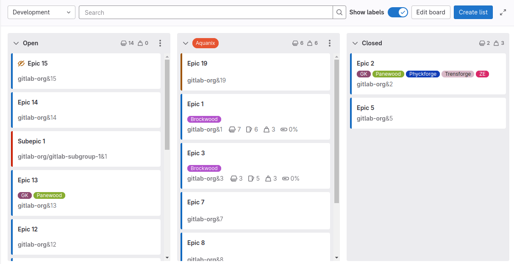
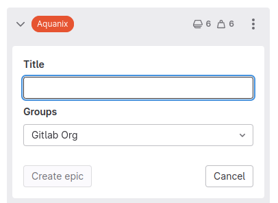

# Epic boards **(PREMIUM ALL)**

> - [Introduced](https://gitlab.com/groups/gitlab-org/-/epics/5067) in GitLab 13.10.
> - [Feature flag removed](https://gitlab.com/gitlab-org/gitlab/-/issues/290039) in GitLab 14.1.
> - Displaying total weight on the top of lists [introduced](https://gitlab.com/gitlab-org/gitlab/-/issues/364503) in GitLab 15.11.

Epic boards build on the existing [epic tracking functionality](index.md) and
[labels](../../project/labels.md). Your epics appear as cards in vertical lists, organized by their assigned
labels.

On the top of each list, you can see the number of epics in the list (**{epic}**) and the total weight of all its epics (**{weight}**).

  See the video: <a href="https://www.youtube.com/watch?v=I1bFIAQBHB8">Epics and Issue Boards - Project Management</a>.

<figure class="video-container">
  <iframe src="https://www.youtube-nocookie.com/embed/I1bFIAQBHB8" frameborder="0" allowfullscreen> </iframe>
</figure>

To view an epic board:

1. On the left sidebar, at the top, select **Search GitLab** (**{search}**) to find your group.
1. Select **Plan > Epic boards**.

## Create an epic board

Prerequisites:

- You must have at least the Reporter role for a group.

To create a new epic board:

1. On the left sidebar, at the top, select **Search GitLab** (**{search}**) to find your group.
1. Select **Plan > Epic boards**.
1. In the upper-left corner, select the dropdown list with the current board name.
1. Select **Create new board**.
1. Enter the new board's title.
1. Optional. To hide the Open or Closed lists, clear the **Show the Open list** and
   **Show the Closed list** checkboxes.
1. Optional. Set board scope:
   1. Next to **Scope**, select **Expand**.
   1. Next to **Labels**, select **Edit** and select the labels to use as board scope.
1. Select **Create board**.

Now you can [add some lists](#create-a-new-list).
To change these options later, [edit the board](#edit-the-scope-of-an-epic-board).

## Delete an epic board

> [Introduced](https://gitlab.com/groups/gitlab-org/-/epics/5079) in GitLab 14.0.

Prerequisites:

- You must have at least the Reporter role for a group.
- A minimum of two boards present in a group.

To delete the active epic board:

1. In the upper-left corner of the epic board page, select the dropdown list.
1. Select **Delete board**.
1. Select **Delete**.

## Actions you can take on an epic board

- [Create a new list](#create-a-new-list).
- [Remove an existing list](#remove-a-list).
- [Filter epics](#filter-epics).
- Create workflows, like when using [issue boards](../../project/issue_board.md#issue-board-workflow-between-teams).
- [Move epics and lists](#move-epics-and-lists).
- Change epic labels (by dragging an epic between lists).
- Close an epic (by dragging it to the **Closed** list).
- [Edit the scope of a board](#edit-the-scope-of-an-epic-board).

### Create a new list

Prerequisites:

- You must have at least the Reporter role for a group.

To create a new list:

1. On the left sidebar, at the top, select **Search GitLab** (**{search}**) to find your group.
1. Select **Plan > Epic boards**.
1. In the upper-right corner, select **Create list**.
1. In the **New list** column expand the **Select a label** dropdown list and select the label to use as
   list scope.
1. Select **Add to board**.

### Remove a list

Removing a list doesn't have any effect on epics and labels, as it's just the
list view that's removed. You can always create it again later if you need.

Prerequisites:

- You must have at least the Reporter role for a group.

To remove a list from an epic board:

1. On the top of the list you want to remove, select the **List settings** icon (**{settings}**).
   The list settings sidebar opens on the right.
1. Select **Remove list**.
1. On the confirmation dialog, select **OK**.

### Create an epic from an epic board

> [Introduced](https://gitlab.com/gitlab-org/gitlab/-/issues/233568) in GitLab 14.0.

Prerequisites:

- You must have at least the Reporter role for a group.
- You must have [created a list](#create-a-new-list) first.

To create an epic from a list in epic board:

1. On the top of a list, select the **New epic** (**{plus}**) icon.
1. Enter the new epic's title.
1. Select **Create epic**.

### Filter epics

> [Introduced](https://gitlab.com/groups/gitlab-org/-/epics/5079) in GitLab 14.0.

Use the filters on top of your epic board to show only
the results you want. It's similar to the filtering used in the epic list,
as the metadata from the epics and labels is re-used in the epic board.

You can filter by the following:

- Author
- Label

### View count of issues, weight, and progress of an epic

> [Introduced](https://gitlab.com/gitlab-org/gitlab/-/issues/331330) in GitLab 14.1.

Epics on an epic board show a summary of their issues, weight, and progress.
To see the number of open and closed issues and the completed and incomplete
weight, hover over the issues icon **{issues}**, weight icon **{weight}**, or
progress icon **{progress}**.

### Move epics and lists

> [Introduced](https://gitlab.com/groups/gitlab-org/-/epics/5079) in GitLab 14.0.

You can move epics and lists by dragging them.

Prerequisites:

- You must have at least the Reporter role for a group.

To move an epic, select the epic card and drag it to another position in its current list or
into another list. Learn about possible effects in [Dragging epics between lists](#dragging-epics-between-lists).

To move a list, select its top bar, and drag it horizontally.
You can't move the **Open** and **Closed** lists, but you can hide them when editing an epic board.

#### Move an epic to the start of the list

> [Introduced](https://gitlab.com/gitlab-org/gitlab/-/issues/367473) in GitLab 15.4.

When you have many epics, it's inconvenient to manually drag an epic from the bottom of a board list all
the way to the top. You can move epics to the top of the list with a menu shortcut.

Your epic is moved to the top of the list even if other epics are hidden by a filter.

Prerequisites:

- You must at least have the Reporter role for a group.

To move an epic to the start of the list:

1. In an epic board, hover over the card of the epic you want to move.
1. Select the vertical ellipsis (**{ellipsis_v}**), then **Move to start of list**.

#### Move an epic to the end of the list

> [Introduced](https://gitlab.com/gitlab-org/gitlab/-/issues/367473) in GitLab 15.4.

When you have many epics, it's inconvenient to manually drag an epic from the top of a board list all
the way to the bottom. You can move epics to the bottom of the list with a menu shortcut.

Your epic is moved to the bottom of the list even if other epics are hidden by a filter.

Prerequisites:

- You must at least have the Reporter role for a group.

To move an epic to the end of the list:

1. In an epic board, hover over the card of the epic you want to move.
1. Select the vertical ellipsis (**{ellipsis_v}**), then **Move to end of list**.

#### Dragging epics between lists

When you drag epics between lists, the result is different depending on the source list
and the target list.

|                       | To Open        | To Closed  | To label B list                |
| --------------------- | -------------- | ---------- | ------------------------------ |
| **From Open**         | -              | Close epic | Add label B                    |
| **From Closed**       | Reopen epic    | -          | Reopen epic and add label B    |
| **From label A list** | Remove label A | Close epic | Remove label A and add label B |

### Edit the scope of an epic board

Prerequisites:

- You must have at least the Reporter role for a group.

To edit the scope of an epic board:

1. In the upper-right corner, select **Edit board**.
1. Optional:
   - Edit the board's title.
   - Show or hide the Open and Closed columns.
   - Select other labels as the board's scope.
1. Select **Save changes**.
